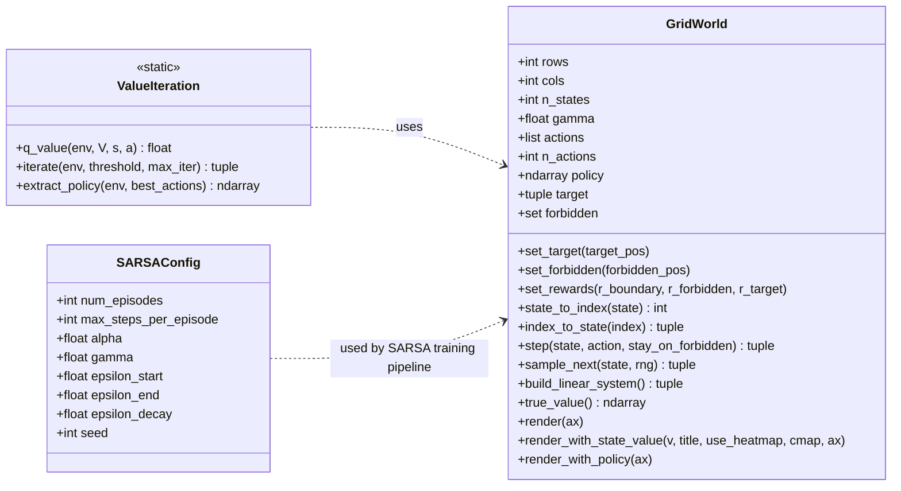

# RL 目录结构与类图

## 目录结构（按功能）

- `RL/grid_world.py`：核心环境类 `GridWorld`
- `RL/BellmanEquation/policy_evaluation.py`：策略评估脚本（函数式，无类）
- `RL/BellamOptimalEquation/value_iteration.py`：值迭代类 `ValueIteration`
- `RL/TD learning/TD-Linear_example.py`：TD 线性状态价值近似脚本（函数式，无类）
- `RL/TD learning/sarsa_with_linear_function_approximation.py`：SARSA 线性动作价值近似，含配置类 `SARSAConfig`

> 说明：当前 RL 代码主要是“一个核心环境类 + 多个算法脚本”。  
> 严格意义上的类图只包含实际定义的类，不把普通函数当作类节点。

## Mermaid 类图

